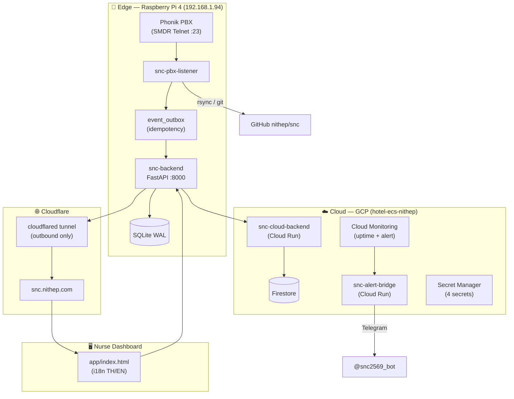

<div align="center">

# 🏥 SNC — Smart Nurse Call

**ระบบแจ้งเตือนพยาบาล Real-time สำหรับโรงพยาบาล / ศูนย์ดูแลผู้ป่วย**

ดัดแปลงตู้สาขา **Phonik PBX** + บอร์ด **Help Call (Call Station v.107)** ให้เป็น Nurse Call ยุคใหม่
บน **Raspberry Pi 4** ภายใต้แบรนด์ **nithep**

[](https://snc.nithep.com)
[](https://www.raspberrypi.com/)
[](https://www.python.org/)
[](https://fastapi.tiangolo.com/)
[](https://cloud.google.com/run)
[](https://www.terraform.io/)

**🌐 ดูระบบจริง: [https://snc.nithep.com](https://snc.nithep.com)**

</div>

---

## ✨ คุณสมบัติ (Features)

| ความสามารถ | รายละเอียด |
|---|---|
| 🔔 **Real-time Alert** | ผู้ป่วยกดปุ่ม/ดึงสายฉุกเฉิน → พยาบาลเห็นทันทีที่เคาน์เตอร์ |
| 📡 **SMDR ผ่าน Telnet** | อ่านสัญญาณจากตู้ Phonik PBX (`192.168.1.91:23`) ถอดรหัสเป็น FHIR JSON |
| 🗺️ **Dashboard ไทย/อังกฤษ** | Grid ห้องพัก (เขียว=ปกติ / แดงกะพริบ=ฉุกเฉิน / เหลือง=รับเรื่อง) + เสียงเตือน |
| ⏱️ **SLA / Response Time** | จับเวลาตั้งแต่ Alert จนกว่าพยาบาลจะ Acknowledge/Clear |
| ☁️ **Cloud + Edge** | Pi4 รัน local, Cloud Run เป็นสำรอง + แจ้งเตือน Telegram |
| 🛡️ **FHIR Ready** | Payload มาตรฐาน HL7 FHIR JSON ตั้งแต่วันแรก พร้อมขึ้น GCP Healthcare API |

---

## 🧭 สถาปัตยกรรมทั้งระบบ (System Topology)

> แผนที่ความเชื่อมโยงฉบับสมบูรณ์: [**ADR 0008**](doc/adr/0008-system-topology-interconnection.md) · [**ARCHITECTURE_FLOW.md**](doc/ARCHITECTURE_FLOW.md)



---

## 🏛️ โครงสร้าง 5-Core

| โฟลเดอร์ | บทบาท |
|---|---|
| **`api/`** | 🔧 API Server (FastAPI + SQLite/Firestore + WebSocket) — Business Logic, SLA/KPI, FHIR |
| **`app/`** | 🖥️ Nurse Dashboard (`index.html` self-contained, Dark Mode, i18n ไทย/อังกฤษ) |
| **`pbx/`** | 📞 SMDR/Telnet Edge Listener (`snc_pbx_listener.py`) + Outbox + TCP proxy |
| **`ops/`** | ⚙️ DevOps — Deploy, systemd units, Terraform IaC, Backup, Monitoring |
| **`doc/`** | 📚 เอกสาร OKF + Obsidian vault — Blueprint, ADRs, Wiki, Handovers |

---

## 🚀 Quick Start (บน Pi 4)

```bash
# clone + รัน
cd ~/snc
./ops/quick_start.sh            # รัน API + Listener อัตโนมัติ

# ตรวจสอบสถานะ
curl -s http://localhost:8000/health
```

### Deploy ไป Pi 4 (จากเครื่อง dev)
```bash
./ops/deploy-snc-one-shot.sh    # rsync api/app/pbx + restart services
```

---

## 🔄 วงจรการทำงาน (Core Workflow)

```
ผู้ป่วยกดปุ่ม / ดึงสายฉุกเฉิน / ยกหู
   →  Phonik PBX พ่น SMDR Log (TCP Telnet)
   →  snc_pbx_listener (Parser → FHIR JSON) + Outbox
   →  snc-backend (SQLite WAL + WebSocket broadcast)
   →  Nurse Dashboard (Grid + Alarm + SLA Timer)
   →  พยาบาลกด Acknowledge / Clear ✅
```

---

## 🛡️ ความปลอดภัย & ความทนทาน (Security & Durability)

- 🔑 **API Key** (`SNC_API_KEY`) กันการโจมตีจาก LAN — ตรงกันทั้ง Pi + Cloud Run
- 📤 **Outbox + Idempotency** (ADR 0004) — กัน event หาย/ซ้ำ, SLA นับถูก
- 🔁 **Self-Healing** — systemd `Restart=always` + PBX Watchdog
- 💾 **SQLite WAL** + auto-backup (cron) + offsite backup
- 🔐 **Secret Manager** บน GCP (ไม่ใช้ plaintext env) — ADR 0005
- 🔄 **Token/Key Rotation Guide** — [`SNC_API_KEY_ROTATION_GUIDE.md`](doc/wiki/SNC_API_KEY_ROTATION_GUIDE.md) · [`SNC_TELEGRAM_ROTATION_GUIDE.md`](doc/wiki/SNC_TELEGRAM_ROTATION_GUIDE.md)
- 🧩 **Optional Intelligence Plugin** — เปิด routes ด้วย `SNC_INTELLIGENCE_ENABLED=true`; ค่าเริ่มต้นปิดเพื่อรักษา Core-only mode

---

## 🏛️ สถาปัตยกรรม Decision (ADR)

| ADR | เรื่อง |
|---|---|
| [0001](doc/adr/0001-record-architecture-decisions.md) | มาตรฐานการบันทึก ADR |
| [0002](doc/adr/0002-separate-alert-bridge.md) | แยก Alert Bridge เป็น service อิสระ |
| [0003](doc/adr/0003-firestore-over-sqlite-cloud.md) | Firestore แทน SQLite บน Cloud Run |
| [0004](doc/adr/0004-outbox-idempotency.md) | Outbox + Idempotency (กัน data loss) |
| [0005](doc/adr/0005-iac-terraform.md) | IaC ด้วย Terraform |
| [0006](doc/adr/0006-broker-dual-pi.md) | (อนาคต) Broker + Dual Pi |
| [0007](doc/adr/0007-nomenclature-separation.md) | แยกชื่อ SNC ออกจาก Hotel-ECS |
| [0008](doc/adr/0008-system-topology-interconnection.md) | โครงสร้างความเชื่อมโยงทั้งระบบ |
| [0011](doc/adr/0011-snc-intelligence-module.md) | SNC Intelligence Module — Ops Self-Healing นอก Critical Path |

---

## 📚 เอกสารเพิ่มเติม (Docs)

- 📘 [**BLUEPRINT_5CORE.md**](doc/BLUEPRINT_5CORE.md) — Blueprint & Conventions มาตรฐาน
- 🚀 [**DEPLOYMENT_PI4.md**](doc/DEPLOYMENT_PI4.md) — คู่มือ Deploy บน Pi 4
- 📐 [**ARCHITECTURE_FLOW.md**](doc/ARCHITECTURE_FLOW.md) — ผังสถาปัตยกรรม (Mermaid)
- 📖 [**doc/INDEX.md**](doc/INDEX.md) — สารบัญความรู้ทั้งหมด
- 🤖 [**SNC_INTELLIGENCE_MODULE_GUIDE.md**](doc/wiki/SNC_INTELLIGENCE_MODULE_GUIDE.md) — คู่มือ SNC Intelligence Module เฟสที่ 1–3

---

<div align="center">

*ดำเนินการจัดทำและดูแลโดย **nithep** — Production-Grade Smart Systems* 🏥

</div>