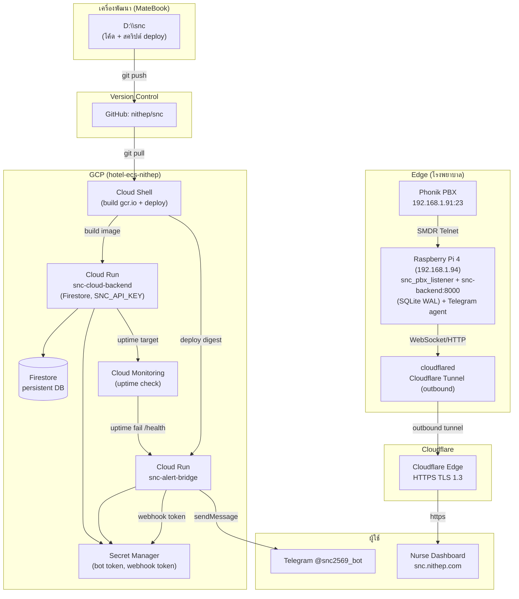
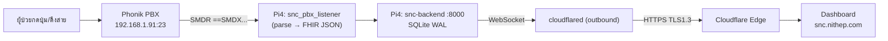
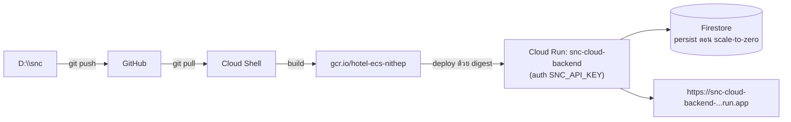
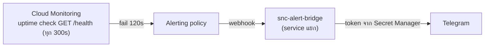

# SNC — ผังสถาปัตยกรรมและการไหลของข้อมูล (รวม Edge + Cloud)

## Knowledge Header

| หัวข้อ | สรุป |
|---|---|
| **สถานะระบบ** | Hybrid architecture แบบ **edge-first + cloud-assisted** |
| **Source of truth** | Pi4 เป็นจุดประมวลผลและเก็บ event จริงในพื้นที่หน้างาน; Cloud Run/Firestore เป็นชั้น persistence และ monitoring ฝั่ง cloud |
| **เส้นทางพัฒนาและ deploy** | `D:\\snc` → GitHub `nithep/snc` → Pi4 และ GCP Cloud Run |
| **Public access** | Cloudflare Tunnel แบบ outbound เท่านั้น → `snc.nithep.com` |
| **Alert monitoring** | Cloud Monitoring → `snc-alert-bridge` → Telegram; แยกจาก backend หลักเพื่อหลีกเลี่ยง shared failure |
| **ปัจจัยเสี่ยงหลัก** | tunnel/domain drift, deploy mismatch, secret/auth mismatch และความแตกต่างระหว่าง edge กับ cloud data |

## สรุปสำหรับทีม

- ระบบ SNC ยึด **Pi4 เป็น source of truth สำหรับ event จาก PBX แบบ real-time** เพราะอยู่ใน LAN เดียวกับตู้ Phonik และยังทำงานได้แม้ cloud ขัดข้อง
- Cloud Run ทำหน้าที่เป็น **cloud backend, persistence, public API และ monitoring** โดยใช้ Firestore รองรับ scale-to-zero
- การแจ้งเตือนแยกเป็น service (`snc-alert-bridge`) เพื่อให้ Telegram ยังได้รับแจ้งเมื่อ backend หลักล่ม
- GitHub เป็นศูนย์กลาง version control และ deploy source; ทุกการแก้ไขควรตรวจ parity ระหว่าง local, Pi4 และ Cloud Run

## Key Learnings

1. แยก data plane ออกจาก alert plane เพื่อไม่ให้ backend หลักเป็น shared failure ของระบบแจ้งเตือน
2. Pi4 ใช้ `.env` ที่ permission จำกัด ส่วน Cloud Run ใช้ Secret Manager reference ไม่ใช้ plaintext secret
3. Event จาก listener ต้องผ่าน outbox และส่ง `event_id` เป็น idempotency key เพื่อป้องกัน event หายหรือซ้ำ
4. Cloudflare Tunnel เป็นขาออก จึงไม่ต้องเปิด inbound port ที่ router และ ingress ไม่ควรชี้ไป LAN IP ที่ DHCP เปลี่ยนได้
5. ตรวจ deploy parity เป็นงานปฏิบัติการประจำ: source code, API key และ schema ต้องสอดคล้องกันทั้ง Pi4 และ Cloud Run

## Risks / Follow-ups

| ความเสี่ยง/งานติดตาม | แนวทางควบคุม |
|---|---|
| Tunnel หรือ domain drift | ตรวจ `snc.nithep.com/health` และ ingress target หลัง deploy |
| Pi4 กับ Cloud Run ใช้คนละ revision | เปรียบเทียบ commit/image digest และบันทึก revision ที่ deploy |
| `SNC_API_KEY` ไม่ตรงกัน | rotate และ sync ตามคู่มือ พร้อม authenticated synthetic request |
| Event edge/cloud ไม่ตรงกัน | ตรวจ outbox retry/idempotency และกำหนด ownership ของ event ให้ชัดเจน |
| Secret เคยปรากฏใน plaintext | rotate key/token และยืนยันว่า deploy ใช้ Secret Manager reference |

## Next Actions

1. ยืนยัน deploy parity ระหว่าง `D:\\snc`, GitHub, Pi4 และ Cloud Run
2. ตรวจ uptime alert ของ Cloud Run และ Pi4 ผ่าน tunnel พร้อมหลักฐานใน Telegram
3. ทดสอบ synthetic event, outbox retry และ idempotency หลัง deploy รอบถัดไป
4. สรุป operational handover พร้อม owner ของ tunnel, secrets, backup และ incident response

> ผังนี้ครอบคลุมการเชื่อมสัมพันธ์ครบทุกส่วน: **D:\snc (MateBook)**, **GitHub**,
> **Raspberry Pi 4 (Edge)**, **Cloudflare Tunnel/DNS**, **GCP Cloud Run**, และ
> **GCP services** (Firestore / Secret Manager / Cloud Monitoring).
> ดูรายละเอียดส่วน Edge เดิมได้ที่ [[ARCHITECTURE_DIAGRAM]]

## เส้นทางหลัก 3 สาย

### A) สาย Edge (on-prem) — ผ่าน Cloudflare Tunnel

จุดสำคัญ: Tunnel เป็น **ขาออก (Zero Open Ports)** — `snc.nithep.com` ชี้ไป `http://172.17.0.1:8000` (เกตเวย์ Docker bridge) หา `snc-backend.service` พอร์ต 8000

### B) สาย Cloud (GCP Cloud Run)

### C) สาย Alert/Telegram (วงจรเฝ้าระวัง)

Bridge อยู่คนละ service กับ backend หลัก → alert ส่งถึงแม้ backend หลัก down

## ตารางความสัมพันธ์

| ส่วน | บทบาท | จุดเชื่อม |
|------|--------|-----------|
| D:\snc (MateBook) | ต้นทางโค้ด + สคริปต์ deploy | `git push` → GitHub |
| GitHub `nithep/snc` | version control กลาง | Cloud Shell / Pi ดึงจากที่นี่ |
| Pi 4 (192.168.1.94) | Edge — ฟังสัญญาณจริงจาก PBX | ดึงจาก git, รัน backend+listener+cloudflared |
| Cloudflare | Tunnel + DNS | `cloudflared` ขาออก → `snc.nithep.com` |
| Cloud Run | main backend + bridge | deploy จาก Cloud Shell, URL `*.run.app` |
| GCP services | Firestore, Secret Manager, Monitoring | uptime → webhook → bridge |

## ไฟล์อ้างอิง (deploy scripts)
- `ops/deploy_cloudrun_cloudshell.sh` — deploy backend หลัก (Firestore, digest)
- `ops/deploy_bridge_cloudshell.sh` — deploy bridge + Secret Manager (bot/webhook token)
- `ops/setup_cloud_monitoring.sh` — uptime check + alert → Telegram (กัน stale-token)
- `ops/deploy_gcp_cloudrun.ps1` — PowerShell one-shot deploy (Windows/MateBook)
- `ops/deploy-to-pi.bat` — scp สคริปต์ไป Pi (Windows)
- `ops/verify-projects.conf` — สรุปสถานะโครงการแต่ละตัว