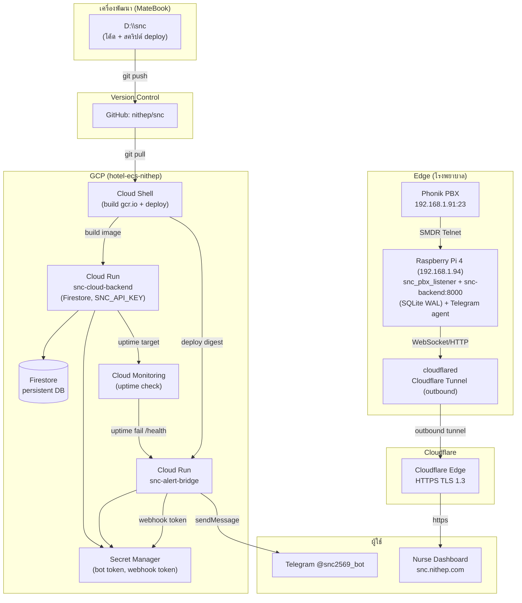
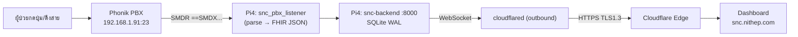
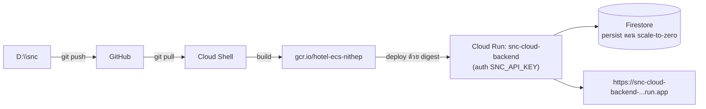
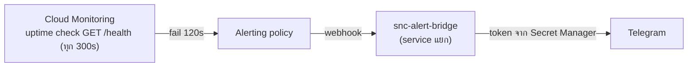

# SNC — ผังสถาปัตยกรรมและการไหลของข้อมูล (รวม Edge + Cloud)

> ผังนี้ครอบคลุมการเชื่อมสัมพันธ์ครบทุกส่วน: **D:\snc (MateBook)**, **GitHub**,
> **Raspberry Pi 4 (Edge)**, **Cloudflare Tunnel/DNS**, **GCP Cloud Run**, และ
> **GCP services** (Firestore / Secret Manager / Cloud Monitoring).
> ดูรายละเอียดส่วน Edge เดิมได้ที่ [[ARCHITECTURE_DIAGRAM]]

## เส้นทางหลัก 3 สาย

### A) สาย Edge (on-prem) — ผ่าน Cloudflare Tunnel

จุดสำคัญ: Tunnel เป็น **ขาออก (Zero Open Ports)** — `snc.nithep.com` ชี้ไป `http://172.17.0.1:8000` (เกตเวย์ Docker bridge) หา `snc-backend.service` พอร์ต 8000

### B) สาย Cloud (GCP Cloud Run)

### C) สาย Alert/Telegram (วงจรเฝ้าระวัง)

Bridge อยู่คนละ service กับ backend หลัก → alert ส่งถึงแม้ backend หลัก down

## ตารางความสัมพันธ์

| ส่วน | บทบาท | จุดเชื่อม |
|------|--------|-----------|
| D:\snc (MateBook) | ต้นทางโค้ด + สคริปต์ deploy | `git push` → GitHub |
| GitHub `nithep/snc` | version control กลาง | Cloud Shell / Pi ดึงจากที่นี่ |
| Pi 4 (192.168.1.94) | Edge — ฟังสัญญาณจริงจาก PBX | ดึงจาก git, รัน backend+listener+cloudflared |
| Cloudflare | Tunnel + DNS | `cloudflared` ขาออก → `snc.nithep.com` |
| Cloud Run | main backend + bridge | deploy จาก Cloud Shell, URL `*.run.app` |
| GCP services | Firestore, Secret Manager, Monitoring | uptime → webhook → bridge |

## ไฟล์อ้างอิง (deploy scripts)
- `ops/deploy_cloudrun_cloudshell.sh` — deploy backend หลัก (Firestore, digest)
- `ops/deploy_bridge_cloudshell.sh` — deploy bridge + Secret Manager (bot/webhook token)
- `ops/setup_cloud_monitoring.sh` — uptime check + alert → Telegram (กัน stale-token)
- `ops/deploy_gcp_cloudrun.ps1` — PowerShell one-shot deploy (Windows/MateBook)
- `ops/deploy-to-pi.bat` — scp สคริปต์ไป Pi (Windows)
- `ops/verify-projects.conf` — สรุปสถานะโครงการแต่ละตัว