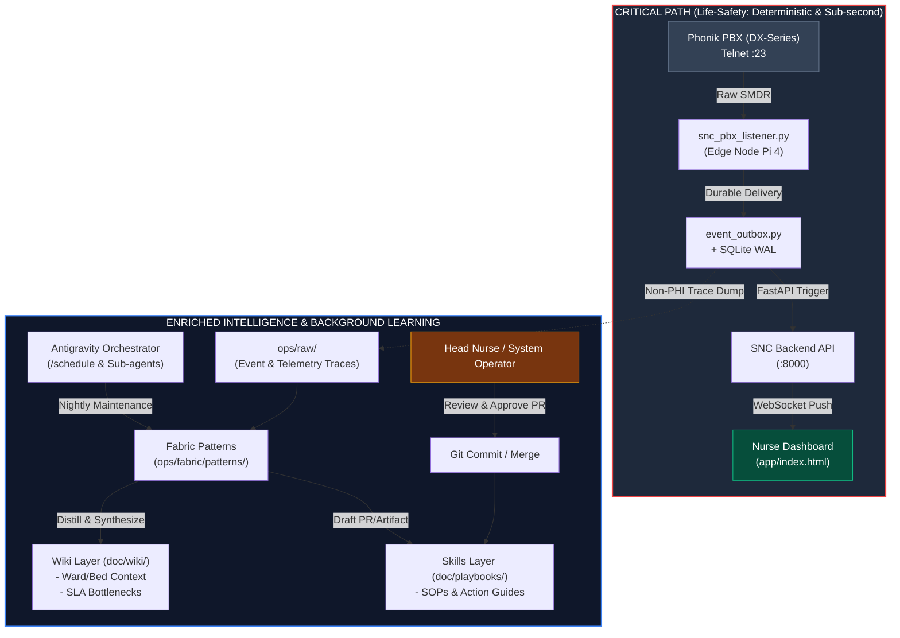
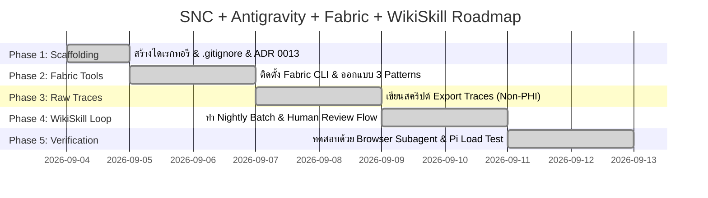

# 🗺️ Roadmap — SNC + Antigravity + Fabric + WikiSkill

> สถาปัตยกรรม Knowledge Loop (บันทึกการตัดสินใจ: [[0013-antigravity-fabric-wikiskill-loop|ADR 0013]])
> Critical Path (ความปลอดภัยชีวิต) ทำงาน deterministic & sub-second — ส่วนนี้คือ
> Enriched Intelligence Layer ที่ไม่รบกวน Critical Path

## 📅 Gantt — 5 เฟส

## ✅ สถานะเฟส

| เฟส | งาน | สถานะ |
|---|---|---|
| **1. Scaffolding** | สร้างไดเรกทอรี (`ops/raw/`, `ops/fabric/patterns/`, `doc/playbooks/`) · `.gitignore` · ADR 0013 | ✅ Done (2026-09-04) |
| **2. Fabric Tools** | ติดตั้ง Fabric CLI (winget 1.4.470) & ออกแบบ 3 Patterns (`snc-trace-summary` / `snc-wiki-distill` / `snc-playbook-draft`) | ✅ Done (2026-09-04) |
| **3. Raw Traces** | เขียนสคริปต์ Export Traces (`ops/export_traces.py`, Non-PHI whitelist) → `ops/raw/` | ✅ Done (2026-09-04) |
| **4. WikiSkill Loop** | Nightly Batch (`ops/nightly-kb-loop.sh` + Fabric 3 patterns) + Human Review Flow (drafts → PR → approve → merge) | ✅ Done (2026-09-04) |
| **5. Verification** | ✅ Done (2026-09-04) — Live E2E บน Pi: loop จริง (111 events/51 breach) · backend `/health` healthy · dashboard 200 · services active · cron 02:30 · พบ/แก้ bug: LLM นับ traces ผิด → เพิ่ม `--stats` deterministic เป็นตัวเลขหลัก |

## 📌 ข้อค้นพบจาก Phase 5 (สำคัญ)

1. **LLM นับสถิติจาก traces ดิบผิดพลาด** (รายงาน 24–34 breach จากจริง 51) → แก้โดยให้
   `ops/export_traces.py --stats` คำนวณสถิติ **deterministic ด้วยเครื่อง** แล้วป้อนเป็น
   ส่วนนำของ input — pattern ถูกสั่งให้ใช้ตัวเลขนั้นเป็นหลัก (ผลลัพธ์หลังแก้: ตรงกับจริง 100%)
2. **Fabric + key แบบ `sk-or-` (OpenRouter)**: ต้องใช้ vendor `OpenRouter` (env
   `OPENROUTER_API_KEY`) และ **unset `GEMINI_API_KEY`** ไม่งั้น fabric จะลองเรียก
   Gemini vendor ก่อนแล้ว error 400 หลุดมาปน stdout
3. Timing: export 111 records < 1s · fabric ~12s/call · loop เต็ม ~38s — เหมาะกับ nightly

## 🔗 เอกสารอ้างอิง

- [[0013-antigravity-fabric-wikiskill-loop|ADR 0013]] — การตัดสินใจเชิงสถาปัตยกรรม
- `ops/raw/README.md` — กฎ Non-PHI / นโยบาย gitignore ของ trace dump
- `ops/fabric/patterns/README.md` — การติดตั้ง Fabric CLI + มาตรฐาน/การใช้งาน Patterns (Phase 2)
- `doc/playbooks/README.md` — กระบวนการ Human Approval ก่อนเข้า playbooks