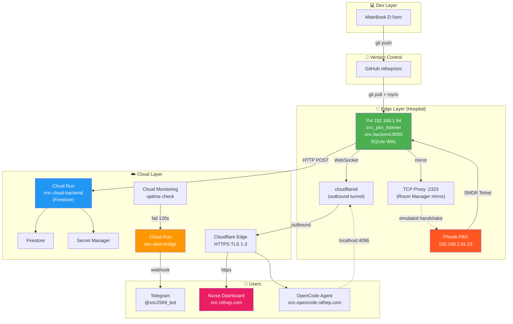
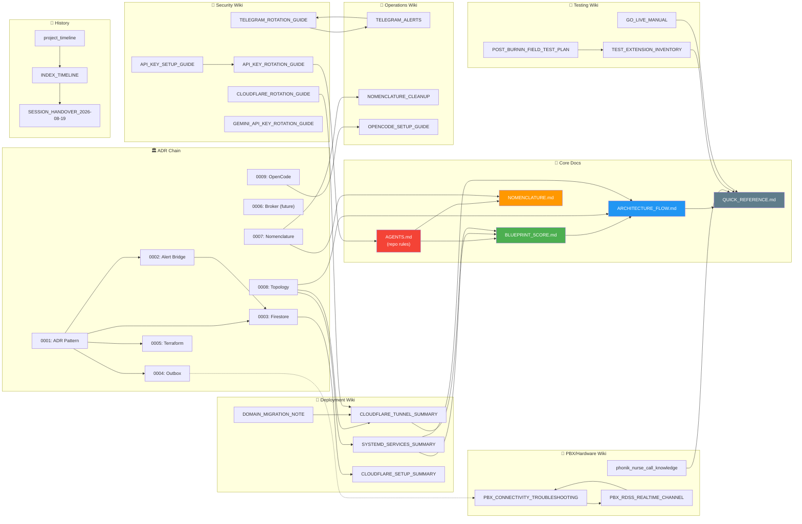
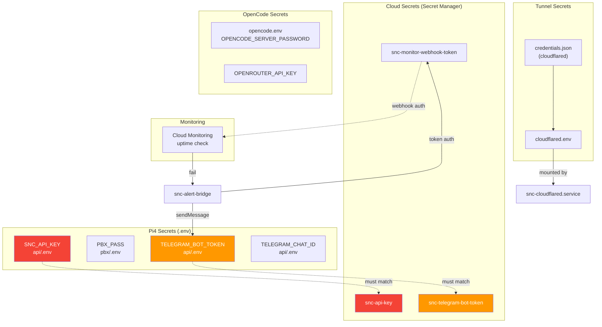
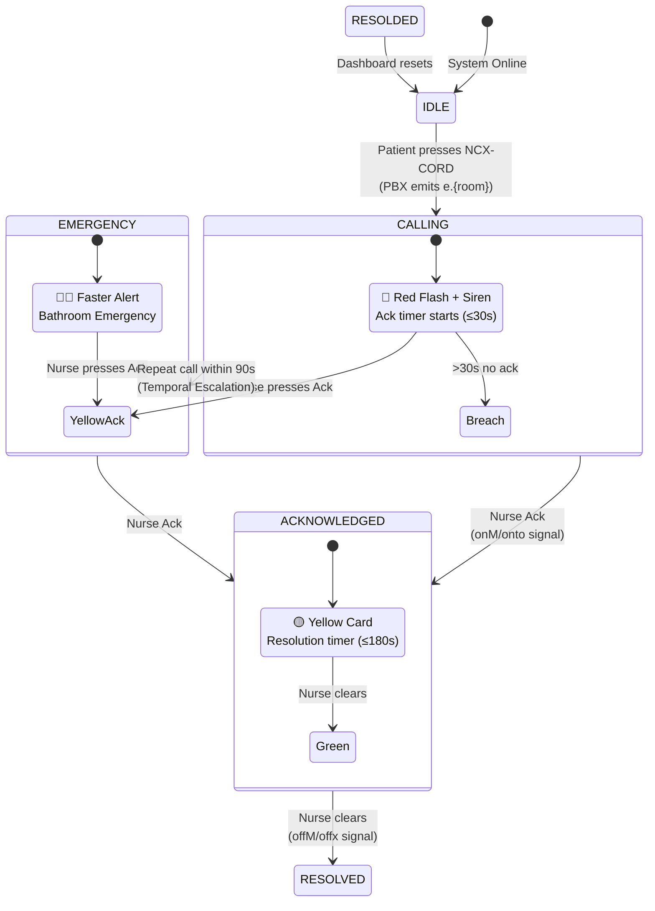
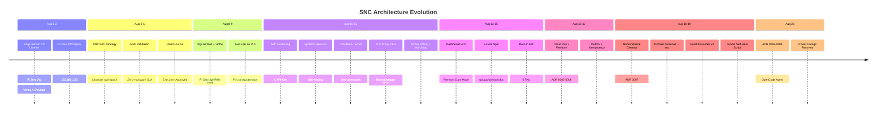

# 🗺️ SNC Knowledge Graph — Visual Dependency Map

> **Purpose:** แผนที่เชื่อมโยงเอกสารทั้งหมดของ SNC ให้ agent เห็นภาพรวมว่า
> ความรู้แต่ละชิ้นเชื่อมกับชิ้นไหน — อ่านเป็น flow หรือ lookup ตามต้องการ
> **Created:** 2026-08-21 · **Version:** 1.0

---

## 🔄 Agent Flow (Sequential — เรียงตามลำดับที่ agent ควรอ่าน)

```mermaid
flowchart TD
    START["🤖 Agent Loads SKILL.md"] --> S1
    S1["STEP 1: Understand System<br/>What SNC does, 5-step workflow"] --> S2
    S2["STEP 2: Know the Layout<br/>5-Core structure + Nomenclature"] --> S3
    S3["STEP 3: Event Flow<br/>Signal→Event matrix + RDSS"] --> S4
    S4["STEP 4: Network & Connectivity<br/>Ports, proxy 2323, handshake"] --> S5
    S5["STEP 5: Security & Secrets<br/>Auth model, .env sync, rotation"] --> S6
    S6["STEP 6: Architecture Decisions<br/>ADR chain 0001→0009"] --> S7
    S7["STEP 7: Deploy & Operate<br/>Systemd + Cloud + Tunnel"] --> S8
    S8["STEP 8: Troubleshooting<br/>Find & fix by symptom"] --> S9
    S9["STEP 9: Telegram & Monitoring<br/>Alerting chain"] --> S10
    S10["STEP 10: KPI Targets<br/>SLA compliance"] --> S11
    S11["STEP 11: Operating Modes<br/>/snc diagnose|test|deploy|kpi"] --> S12
    S12["STEP 12: History & Timeline<br/>When things happened"] --> S13
    S13["STEP 13: Safety Rules<br/>Never break these"] --> S14
    S14["STEP 14: Collaboration Map<br/>Who does what"]

    style START fill:#4CAF50,color:#fff
    style S1 fill:#2196F3,color:#fff
    style S2 fill:#2196F3,color:#fff
    style S3 fill:#FF9800,color:#fff
    style S4 fill:#FF9800,color:#fff
    style S5 fill:#f44336,color:#fff
    style S6 fill:#9C27B0,color:#fff
    style S7 fill:#4CAF50,color:#fff
    style S8 fill:#f44336,color:#fff
    style S9 fill:#FF9800,color:#fff
    style S10 fill:#2196F3,color:#fff
    style S11 fill:#4CAF50,color:#fff
    style S12 fill:#607D8B,color:#fff
    style S13 fill:#f44336,color:#fff
    style S14 fill:#607D8B,color:#fff
```



---

## 🏗️ System Architecture Graph (3-Tier Topology — ADR 0008)



---

## 📊 Document Dependency Graph (Wiki ↔ ADR ↔ Core)



---

## 🔗 Secret Rotation Dependency Graph



---

## ⚡ Event Lifecycle Graph (Signal → DB → Dashboard)



---

## 📁 5-Core File Tree with Knowledge Links

```
snc/
├── api/
│   ├── server.py ─────────────────── ADR 0003 (Firestore), ADR 0004 (idempotency)
│   ├── storage.py ────────────────── ADR 0003 (factory: sqlite|firestore)
│   ├── bridge_server.py ──────────── ADR 0002 (alert bridge, แยก service)
│   ├── nurse_call_events.db ──────── SQLite WAL (Edge DB)
│   ├── services/
│   │   └── gemini_direct_service.py  AI report generation
│   └── .env ──────────────────────── 🔐 STEP 5 (SNC_API_KEY, TELEGRAM_*)
│
├── app/
│   ├── index.html ────────────────── Nurse Dashboard v2.0
│   ├── landing.html ──────────────── Landing page (SEO)
│   ├── roi.html ──────────────────── Content article
│   ├── snc-vs-imported.html ──────── Content article
│   └── how-to-phonik.html ────────── Content article + SOS CALL
│
├── pbx/
│   ├── snc_pbx_listener.py ──────── STEP 3 (SMDR/RDSS), STEP 4 (proxy 2323)
│   ├── event_outbox.py ───────────── ADR 0004 (durable delivery)
│   ├── test_smdr_parser.py ──────── STEP 11 (test mode)
│   └── .env ──────────────────────── 🔐 STEP 5 (PBX_PASS, SNC_API_KEY)
│
├── ops/
│   ├── notify-telegram.sh ────────── STEP 9 (Telegram alert)
│   ├── snc_telegram_agent.py ─────── STEP 9 (Q&A agent)
│   ├── tunnel-self-heal.sh ──────── STEP 9 (auto-recover tunnel)
│   ├── snc-evening-digest.sh ─────── STEP 9 (daily digest)
│   ├── deploy-snc-one-shot.sh ────── STEP 7 (deploy)
│   ├── backup-snc-db.sh ──────────── STEP 7 (backup cron)
│   ├── verify-daily.sh ──────────── STEP 9 (daily verify)
│   └── terraform/ ────────────────── ADR 0005 (IaC)
│
└── doc/
    ├── BLUEPRINT_5CORE.md ────────── STEP 2 (project structure)
    ├── ARCHITECTURE_FLOW.md ──────── STEP 7 (full topology)
    ├── NOMENCLATURE.md ───────────── STEP 2 (glossary)
    ├── QUICK_REFERENCE.md ────────── STEP 8 (cheat card)
    ├── adr/ ──────────────────────── STEP 6 (0001-0009)
    └── wiki/
        ├── phonik_nurse_call_knowledge.md ── STEP 1 (HW catalog)
        ├── SNC_PBX_RDSS_REALTIME_CHANNEL.md ── STEP 3 (RDSS)
        ├── SNC_PBX_CONNECTIVITY_TROUBLESHOOTING.md ── STEP 8
        ├── SNC_SYSTEMD_SERVICES_SUMMARY.md ── STEP 7
        ├── SNC_CLOUDFLARE_TUNNEL_SUMMARY.md ── STEP 7
        ├── SNC_TELEGRAM_ALERTS.md ── STEP 9
        ├── SNC_API_KEY_ROTATION_GUIDE.md ── STEP 5
        ├── SNC_TELEGRAM_ROTATION_GUIDE.md ── STEP 5
        ├── SNC_CLOUDFLARE_ROTATION_GUIDE.md ── STEP 5
        ├── SNC_GO_LIVE_MANUAL.md ── STEP 11
        ├── SNC_POST_BURNIN_FIELD_TEST_PLAN.md ── STEP 11
        ├── SNC_TEST_EXTENSION_INVENTORY.md ── STEP 3
        ├── SNC_NOMENCLATURE_CLEANUP.md ── STEP 2
        ├── SNC_DOMAIN_MIGRATION_NOTE.md ── STEP 7
        ├── SNC_OPENCODE_SETUP_GUIDE.md ── STEP 6 (ADR 0009)
        ├── SNC_SOVEREIGN_AI_BLUEPRINT.md ── Architecture
        ├── project_timeline.md ── STEP 12
        ├── INDEX_TIMELINE.md ── STEP 12
        ├── SESSION_HANDOVER_2026-08-19.md ── STEP 12
        └── WINDOWS_SCHEDULED_TASK_HYGIENE.md ── Ops
```

---

## 🔍 Lookup by Concern (Find the Right Doc Fast)

| ต้องการรู้... | อ่าน... |
|--------------|---------|
| ฮาร์ดแวร์ Phonik คืออะไร | `wiki/phonik_nurse_call_knowledge.md` |
| ตู้ต่อสายยังไง | `wiki/phonik_nurse_call_knowledge.md` §4 |
| ระบบ SOS CALL ทำงานยังไง | `wiki/phonik_nurse_call_knowledge.md` §7.1 |
| Listener แปลงสัญญาณยังไง | STEP 3 (SKILL.md) + `pbx/snc_pbx_listener.py` |
| RDSS poll คืออะไร | `wiki/SNC_PBX_RDSS_REALTIME_CHANNEL.md` |
| ตู้ไม่ยอมต่อ (Errno 111) | `wiki/SNC_PBX_CONNECTIVITY_TROUBLESHOOTING.md` |
| Session lock แก้ยังไง | `wiki/SNC_PBX_CONNECTIVITY_TROUBLESHOOTING.md` + power cycle |
| Systemd ตั้งค่ายังไง | `wiki/SNC_SYSTEMD_SERVICES_SUMMARY.md` |
| Cloudflare tunnel ตั้งค่ายังไง | `wiki/SNC_CLOUDFLARE_TUNNEL_SUMMARY.md` |
| Tunnel 502 แก้ยังไง | `wiki/SNC_CLOUDFLARE_TUNNEL_SUMMARY.md` §กฎเหล็ก |
| Tunnel self-heal ทำงานยังไง | ADR 0009 + `ops/tunnel-self-heal.sh` |
| หมุน API key ยังไง | `wiki/SNC_API_KEY_ROTATION_GUIDE.md` |
| หมุน Telegram token ยังไง | `wiki/SNC_TELEGRAM_ROTATION_GUIDE.md` |
| หมุน Cloudflare credentials ยังไง | `wiki/SNC_CLOUDFLARE_ROTATION_GUIDE.md` |
| Outbox ทำงานยังไง | ADR 0004 + `pbx/event_outbox.py` |
| Firestore vs SQLite ต่างกันยังไง | ADR 0003 + `api/storage.py` |
| Bridge คืออะไร ทำไมแยก | ADR 0002 |
| ทำไมต้อง Terraform | ADR 0005 |
| ทำไมยังไม่ใช้ Broker | ADR 0006 |
| ชื่อ legacy แก้ยังไง | ADR 0007 + `wiki/SNC_NOMENCLATURE_CLEANUP.md` |
| Domain ย้ายจาก nursecall → snc ยังไง | `wiki/SNC_DOMAIN_MIGRATION_NOTE.md` |
| OpenCode ติดตั้งยังไง | ADR 0009 + `wiki/SNC_OPENCODE_SETUP_GUIDE.md` |
| Telegram bot ตั้งค่ายังไง | `wiki/SNC_TELEGRAM_ALERTS.md` |
| Q&A agent ถามอะไรได้บ้าง | `wiki/SNC_TELEGRAM_ALERTS.md` §Q&A |
| สาธิตผู้บริหารยังไง | `wiki/SNC_GO_LIVE_MANUAL.md` |
| Field test ทดสอบอะไรบ้าง | `wiki/SNC_POST_BURNIN_FIELD_TEST_PLAN.md` |
| Timeline โครงการ | `wiki/project_timeline.md` |
| Handover ล่าสุด | `wiki/SESSION_HANDOVER_2026-08-19.md` |
| Topology ทั้งระบบ | ADR 0008 + `doc/ARCHITECTURE_FLOW.md` |
| KPI targets | STEP 10 (SKILL.md) |
| กฎ agent อะไรบ้าง | `AGENTS.md` + STEP 13 (SKILL.md) |

---

## 📐 Architecture Evolution Timeline



---

*Graphview v1.0 — สร้างจาก wiki 28 ไฟล์ + ADR 9 ฉบับ + raw 9 ไฟล์ + core docs 6 ไฟล์*
*อัปเดตครั้งถัดไปเมื่อมี ADR หรือ wiki doc ใหม่*
