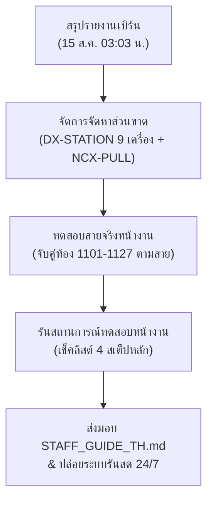

# 📋 แผนการทดสอบใช้งานจริงหลังเสร็จสิ้นการ Burn-in (Post-Burn-In Field-Test Plan)

> **โครงการ:** Smart Nurse Call (SNC) PoC — โรงพยาบาลราชเวช ชั้น 11 (F11-NC)  
> **อัปเดตสถานะล่าสุด:** 15 ส.ค. 2569 (02:08 น.) — เตรียมพร้อม Go-Live ทันทีหลังจบช่วงเวลาเบิร์น (03:03 น.)

---

## 1. 🔑 สรุปบันทึกประเด็นสำคัญระบบ (Core Configurations Archive)

เพื่อรักษาเสถียรภาพและรวบรวมข้อมูลความลับหลักในการเชื่อมโยงเครือข่าย:

### 1.1 บัญชีข้อมูลและกุญแจความปลอดภัย (SNC Security Vault)
* **Master API Key (`SNC_API_KEY`)**:
  ```text
  <SNC_API_KEY — ค่าจริงอยู่ใน .env ของ Pi / Cloud Run เท่านั้น ไม่บันทึกลงเอกสาร>
  ```
  *(ใช้กรอกในช่องตั้งค่าแดชบอร์ด ⚙️ และกำหนดไว้ในไฟล์ `.env` ของ API / Listener เพื่อตรวจสอบสิทธิ์การเขียนข้อมูล — ดูค่าได้ที่ `/home/ecs-agent/snc-poc/backend/.env` บน Pi หรือ `gcloud run services describe` ที่ Cloud Run)*
* **พิกัดไฟล์ระบบบน Pi 4 (`pi4`)**:
  * ไฟล์คอนฟิกหลัก: `/home/ecs-agent/snc-poc/backend/.env`
  * ฐานข้อมูล SQLite (WAL Mode): `/home/ecs-agent/snc-poc/backend/nurse_call_events.db`

### 1.2 เครือข่ายและการให้บริการสด (Live Endpoints)
* **ตู้สาขาหลัก (Phonik PBX)**: `192.168.1.91:23` (สถานะปัจจุบัน: **Open/Ready ✅**)
* **หน้ากากกระจายสัญญาณ (TCP SMDR Proxy)**: พอร์ต `2323` (ใช้จำลอง Handshake ให้โปรแกรม Room Manager ของตู้ดึงประวัติได้พร้อมกัน)
* **หน้าเว็บแดชบอร์ดในวง LAN**: `http://192.168.1.94:8000/`
* **หน้าเว็บแดชบอร์ดสาธารณะ (Public Ingress)**: `https://nursecall.nithep.com`

---

## 2. 🚀 แผนการทดสอบใช้งานจริงหลังเบิร์น (SNC Post-Burn-In & Field-Test Plan)

แผนทดสอบนี้ออกแบบตามพิกัดและผังการจัดสาย **ชั้น 11 โรงพยาบาลราชเวช (จำนวน 27 ห้องพัก: 1101 - 1127)** เพื่อนำพาระบบเข้าสู่สภาวะพร้อมจำหน่ายและติดตั้งจริง:



### ขั้นที่ 1: รายงานผล Burn-in ฉบับสมบูรณ์ (Immediate Report Verification)
* **เป้าหมาย**: ยืนยันความน่าเชื่อถือของระบบด้วยอัตราการล่ม **0 FAIL** ตลอด 48 ชั่วโมง
* **สิ่งที่ต้องทำ**: ทันทีหลังเวลา **03:03 น. ของวันที่ 15 ส.ค.** ให้เชื่อมเข้าไปยังเครื่อง Pi และรันคำสั่งดึงสรุปผล:
  ```bash
  ssh pi4 '/home/ecs-agent/snc-poc/burnin-monitor.sh --report'
  ```
  *(นำรายงาน Log มาสรุปให้ผู้บริหารโรงพยาบาลเห็นถึงความเสถียรของระบบในการส่งข้อมูลร่วมกับ AI สรุปผล)*

### ขั้นที่ 2: จัดการช่องว่างอุปกรณ์ส่วนขาด (Inventory Sync Action)
* **ประเด็นสำคัญ**: สต็อกเดิมจากใบเสนอราคา (IV3781) มี DX-STATION เพียง 18 เครื่อง และ NCX-CORD 20 เส้น ซึ่ง**ไม่เพียงพอสำหรับ 27 ห้องพัก**
* **แนวทางแก้ไข**: 
  1. เสนอจัดซื้อสั่งเพิ่มเร่งด่วน: **DX-STATION เพิ่มเติมอีก 9 เครื่อง** (เพื่อให้ครบ 27 ชุด) 
  2. จัดซื้อชุดสวิตช์ดึงสายฉุกเฉินในห้องน้ำ (NCX-PULL) และชุดสัญญาณไฟ LED หน้าห้อง (NCX-LED) เพิ่มเติมให้ครบถ้วนทุกห้องน้ำผู้ป่วยตามผัง

### ขั้นที่ 3: จับคู่และลงทะเบียนผังสายจริง (PBX Configuration Register)
* **เป้าหมาย**: ป้องกันปัญหาการระบุห้องผิดพลาดตอนพยาบาลวิ่งไปช่วยชีวิตผู้ป่วย
* **แนวทางปฏิบัติ**:
  1. เช็คพอร์ตสายเดินสัญญาณแบบสลับคู่ L/T/R/H หน้างานจริง
  2. เปิดระบบ Config Builder 150 ตรวจทานและตั้งชื่อพอร์ตบนตู้ PBX (พอร์ต ATI-1 ถึง ATI-4) ให้แมปกับสายสัญญาณห้องจริง **1101 ถึง 1127** และสถานีเคาน์เตอร์ **KEY-1100** ให้ตรงตามแบบแปลนสถาปัตยกรรม

### ขั้นที่ 4: การรันสถานการณ์จริงหน้ารวมทีม (Field-Test Day Execution)
ดำเนินการทดสอบร่วมกับทีมวิศวกรและหัวหน้าพยาบาลในวันนัดหมายจริง (ใช้เวลาดำเนินการ 1.5 ชั่วโมง) โดยไล่ทดสอบตามหัวข้อหลัก:

#### 🧪 สถานการณ์ A: การทดสอบเรียกแบบเดี่ยวข้างเตียง (Bedside Call Verification)
* **ขั้นตอน**: กดสวิตช์เรียกสายข้างเตียง (NCX-CORD) ที่ห้องผู้ป่วยจำลอง
* **เกณฑ์ผ่าน**:
  1. ไฟสถานะสีแดงส้ม (NCX-LED) หน้าห้องผู้ป่วยต้องสว่าง
  2. หน้าแดชบอร์ดของพยาบาลการ์ดห้องผู้ป่วยนั้นต้องกะพริบเป็นสีแดงสดทันที
  3. เสียงแจ้งเตือนไซเรนระดับปกติทำงาน และเวลา Response Time (SLA) เริ่มจับเวลา
  4. เมื่อพยาบาลกดปุ่ม **📞 รับเรื่อง (Ack)** บนหน้าจอ: สถานะการ์ดเปลี่ยนเป็นสีเหลือง, ไฟหน้าห้องสลับจังหวะ, และเสียงเงียบลง

#### 🚨 สถานการณ์ B: ดึงสายฉุกเฉินห้องน้ำ (Bathroom Emergency Escalate)
* **ขั้นตอน**: ทำการดึงสาย EMERGENCY (NCX-PULL) ในห้องน้ำของห้องพักผู้ป่วย
* **เกณฑ์ผ่าน**:
  1. ระบบต้องยกระดับการเตือนภัย (Escalate) เป็นระดับสีแดงกะพริบเร็วถี่สูง
  2. เสียงแจ้งเตือนเตือนภัยบนแดชบอร์ดมีระดับความเร็วและความดังที่รุนแรงขึ้นเพื่อดึงดูดสายตาพยาบาล
  3. เมื่อมีคนดึงสายฉุกเฉินซ้ำภายในเวลา 90 วินาที ระบบวิเคราะห์รูปแบบ (Temporal Pattern) จะต้องปรับประเภทเหตุการณ์อัตโนมัติเป็น **BATHROOM EMERGENCY** ทันที พร้อมยิงเตือนระดับสีแดงด่วนเข้าแอป **Google Chat** และ **Telegram** สำหรับเจ้าหน้าที่ช่าง

#### 🔌 สถานการณ์ C: การกู้คืนระบบแบบกระจายสาย (Connection Loss & Resilience)
* **ขั้นตอน**: ทดลองถอดปลั๊กตู้สาขาชั่วคราว หรือรีสตาร์ทบอร์ด Pi ระหว่างรันระบบ
* **เกณฑ์ผ่าน**:
  1. เมื่อสัญญาณหลุด Watchdog บนเครื่องต้องสั่นสายและสั่ง Force reconnect ใหม่อัตโนมัติใน 10 วินาที
  2. หน้าจอเบราว์เซอร์แดชบอร์ดต้องสลับการเชื่อมต่อเป็นสีส้ม/แดงชั่วคราว และกลับมาเป็นสีเขียวทันทีเมื่อระบบออนไลน์ โดยไม่มีสัญญาณไฟหรือระบบค้างค้างระบบ (No Stale Sessions)

---

## 3. 📝 คำสั่งหลักด่วนสำหรับการนำไปใช้ทดสอบจริง (Quick-Reference)

เพื่อใช้พ่นสืบค้นสถานะจริงหน้าร้านระหว่างทดสอบ:

* **ดึงสถานะสายเรียกสดที่ทำงานอยู่ ณ ขณะนั้น (Active Events)**:
  ```bash
  curl -s http://192.168.1.94:8000/api/events | python3 -c "import sys, json; print(json.dumps([e for e in json.load(sys.stdin) if e['status']=='active'], indent=2, ensure_ascii=False))"
  ```
* **จำลองเหตุการณ์ส่งสัญญาณสดเตียงเรียก (Synthetic trigger) เพื่อเช็คการทำงานของระบบส่งข้อมูล**:
  ```bash
  curl -s -X POST http://192.168.1.94:8000/api/events/trigger \
    -H "Content-Type: application/json" \
    -H "X-API-Key: $SNC_API_KEY" \
    -d '{"room_id":"999","event_type":"CALL_BEDSIDE"}'
  ```

---

*จัดทำแผนงานและบันทึกโดย: Senior Software Engineer (Antigravity Agent) — 15 ส.ค. 2569 (02:08 น.)*
