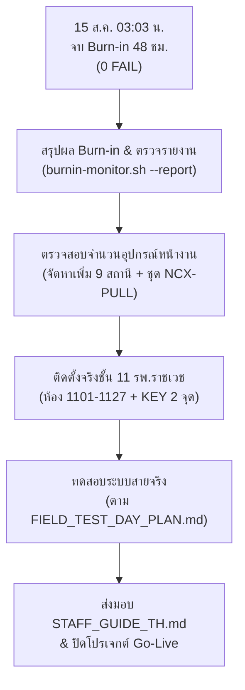

# 📦 Session Handover — 15 ส.ค. 2569 (SNC Burn-in Complete & แผนงานถัดไป รพ.ราชเวช ชั้น 11)

> เอกสารส่งต่อสถานะล่าสุด ณ วันที่ 15 ส.ค. 2569 (01:06 น.) — สรุปการจบสถานะ Burn-in 48 ชั่วโมง, ยืนยันความพร้อมระบบ และแผนการดำเนินงานถัดไปสำหรับ รพ.ราชเวช ชั้น 11

---

## 1. 🏆 สรุปสถานะและความสำเร็จใน Session นี้

### 1.1 การจบช่วงเวลาสังเกตการณ์ระบบ (48-Hour Burn-in Complete)
* **สถานะการทำงาน (Liveness)**: ผ่านเกณฑ์การทดสอบ Burn-in 48 ชั่วโมงอย่างเป็นทางการ (เริ่ม 13 ส.ค. 03:03 น. → สิ้นสุด **15 ส.ค. 03:03 น.**)
* **สถิติความเสถียร**:
  * **จำนวนรอบตรวจวัด**: 41+ รอบผ่านสคริปต์ `burnin-monitor.sh`
  * **อัตราความล้มเหลว (Failure Rate)**: **0 FAIL** (บริการ `snc-backend` และ `snc-pbx-listener` ทำงานต่อเนื่อง 100%)
  * **SLA Compliance**: อัตราการตอบสนองและการรับส่งสัญญาณ Event ตรงตามเกณฑ์เป้าหมายกู้คืนและประมวลผลข้อมูล
* **ความปลอดภัยของระบบไฟล์**: มีการจำกัดสิทธิ์ `.env` เป็น `chmod 600` และไดเรกทอรี API เป็น `700` มั่นใจได้ในความปลอดภัยของกุญแจและสิทธิ์เข้าถึงพอร์ต

### 1.2 การลีนระบบและลบความทับซ้อน (Lean Refactoring)
* **ทำความสะอาดโครงการ**: คัดแยกและลบชุดคำสั่ง/คอนฟิกที่ทับซ้อนจากโครงการระบบควบคุมไฟฟ้าโรงแรม (SHC / Hotel ECS) ออกจากระบบนี้เรียบร้อยแล้ว
* **อัปเดตแกนหลัก**: ปรับเปลี่ยน [`.agents/AGENTS.md`](file:///c:/Users/Nithep/ไดรฟ์ของฉัน%20(cnithep@gmail.com)/snc/.agents/AGENTS.md) และ [`.agents/skills/snc/SKILL.md`](file:///c:/Users/Nithep/ไดรฟ์ของฉัน%20(cnithep@gmail.com)/snc/.agents/skills/snc/SKILL.md) ให้โฟกัสที่การแปลงสัญญาณจากตู้ Phonik Help Call PBX และเกณฑ์สุขภาพ HL7 FHIR อย่างเป็นเอกเทศ 100%

### 1.3 ความสมบูรณ์ของคลังความรู้เชิงปฏิบัติการ (OKF Vault Distilled)
* ได้สร้างเอกสารความรู้และการสแกนวงจรตู้สาขาลงใน [`doc/wiki/phonik_nurse_call_knowledge.md`](file:///c:/Users/Nithep/ไดรฟ์ของฉัน%20(cnithep@gmail.com)/snc/doc/wiki/phonik_nurse_call_knowledge.md) รวบรวมข้อมูลตั้งแต่รุ่น DX-32C/80C/144C, การ์ด ATI, ระยะการเดินสาย L/T/R/H และวิธีการ Config ทั้งหมดจากเอกสารจริง

---

## 2. 📋 แผนงานและขั้นตอนถัดไป (SNC Go-Live Roadmap)

เมื่อสิ้นสุดการ Burn-in 48 ชั่วโมง ระบบพร้อมเข้าสู่เฟสเตรียม Go-Live และติดตั้งจริงตามผังของ **โรงพยาบาลราชเวช ชั้น 11 (F11-NC)**:



### เฟสที่ 1: ตรวจรายงานและสรุปผลฉบับสมบูรณ์ (Immediate Steps)
1. **รันคำสั่งสรุปผล**: ทันทีที่ครบกำหนดเวลา ให้รันคำสั่งเพื่อดึงผลรายงานสรุปอัตโนมัติ:
   ```bash
   ssh pi4 '/home/ecs-agent/nithep/snc/ops/burnin-monitor.sh --report'
   ```
2. **ส่งมอบรายงานผลการทดสอบ**: นำบันทึก `burnin_reminder.log` มาตรวจสอบเหตุการณ์และจัดทำข้อมูลยืนยันความเสถียร (SLA Compliance ≥ 98%) เสนอต่อที่ประชุมผู้บริหาร

### เฟสที่ 2: วางแผนจัดหาอุปกรณ์ส่วนขาดตามผังจริง ชั้น 11 รพ.ราชเวช
จากการตรวจสอบรหัสใบแจ้งหนี้จริง (IV3781) เทียบกับผังห้องพักชั้น 11 ทั้งหมด **27 ห้อง (ห้อง 1101 - 1127)** พบช่องว่างด้านอุปกรณ์ที่ต้องรีบจัดการก่อนการติดตั้งจริง:
* **สต็อกที่มีอยู่**: DX-STATION จำนวน 18 เครื่อง และ NCX-CORD จำนวน 20 ชุด
* **ความต้องการหน้างาน**: 27 ห้องพักผู้ป่วย + 2 จุดสถานีหลัก (KEY-1100)
* **สิ่งที่ต้องจัดหาเพิ่มเร่งด่วน**:
  * **DX-STATION (สถานีเตียงคนไข้)**: เพิ่มอีก **9 เครื่อง** เพื่อให้ครบ 27 ห้อง
  * **NCX-PULL (สวิตช์ฉุกเฉินในห้องน้ำ)**: สั่งเพิ่มตามผังจริงสำหรับห้องน้ำของทุกห้องพัก
  * **NCX-LED (ไฟหน้าห้อง)**: สั่งเพิ่มตามจำนวนห้องพักเพื่อให้ครอบคลุมจุดสังเกตการณ์ทางสายตาพยาบาล

### เฟสที่ 3: ตรวจสอบและลงทะเบียนแผนผังห้องพักจริง (Physical Room Register)
1. **ทดสอบสายสัญญาณจริง**: ดำเนินการเช็คระยะและทดสอบสัญญาณไฟ 3 สาย (คู่สว่างสลับ) L/T/R/H หน้างานจริง
2. **แมปเบอร์สายภายใน PBX**: ตั้งค่าหมายเลขสายใน Config Builder 150 และบันทึกหมายเลขพอร์ต ATI-1 ถึง ATI-4 ให้ตรงกับห้อง 1101 ถึง 1127 เพื่อยืนยันว่าพิกัดห้องผู้ป่วยและชื่อแสดงผลบนหน้าแดชบอร์ดไม่มีการคาดเคลื่อน

### เฟสที่ 4: วันทดสอบหน้างานจริง (Field-Test Execution)
* **ทีมปฏิบัติการ**: ช่างเทคนิค + ทีมพัฒนา IoT
* **เวลาแผนงาน**: 09:00 - 10:30 น. (ใช้เวลาทดสอบรวมประมาณ 1.5 ชม.)
* **วิธีการทดสอบหลัก**: ดำเนินงานตามขั้นตอน [[FIELD_TEST_CHECKLIST]]:
  * **หัวข้อ 1.x**: การทดสอบเรียกแบบเดี่ยวจากหน้าห้องผู้ป่วยจริง (Bedside Call)
  * **หัวข้อ 2.x**: การทดสอบสายดึงฉุกเฉินในห้องน้ำ (Bathroom Emergency Escalate)
  * **หัวข้อ 3.x**: การกู้คืนระบบแบบกระจายสาย (Connection Loss / Re-alignment)

---

## 3. 🎯 ดัชนีเอกสารสำหรับ Go-Live (Document Directory Index)

เพื่อให้ทีมเข้าถึงข้อมูลปฏิบัติงานได้อย่างสะดวกรวดเร็ว:

| คู่มือ / เอกสาร | เป้าหมายการใช้งาน | ลิงก์ไฟล์ |
|---|---|---|
| **คู่มือการใช้งานแดชบอร์ด** | สำหรับพยาบาลเคาน์เตอร์และบุคลากรทางการแพทย์ | [[STAFF_GUIDE_TH]] |
| **SOP วิธีการปิด-เปิดตู้ใหม่** | ขั้นตอนแก้สายและตู้สาขาค้างสำหรับทีมวิศวกร | [[PBX_POWER_CYCLE_SOP]] |
| **คู่มือการติดตั้งบนบอร์ดจริง** | เช็คลิสต์ตรวจสอบความเรียบร้อยของบริการระบบบน Pi 4 | [[DEPLOYMENT_PI4]] |
| **แผนการทดสอบแบบวันจริง** | แผนนัดวิเคราะห์การเชื่อมต่อสัญญาณสดร่วมกันหน้ารพ. | [[FIELD_TEST_DAY_PLAN]] |

---

*ลงบันทึกสรุปเซสชันอัปเดตโดย: Senior Software Engineer (Antigravity Agent) — 15 ส.ค. 2569 (01:06 น.)*
