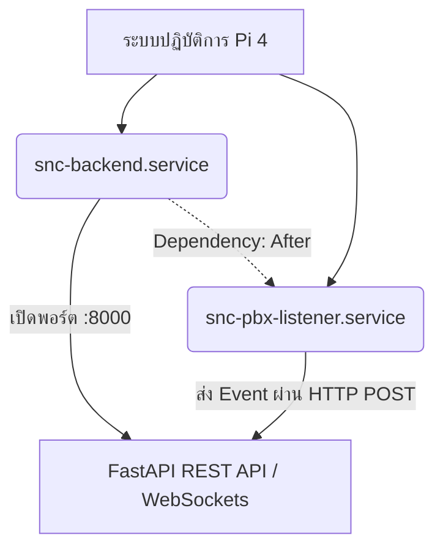

# 📋 คู่มือระบบจัดการสถานะบริการ Systemd (SNC Systemd Services Summary)

เอกสารนี้สรุปข้อกำหนด การติดตั้ง และโครงสร้างการทำงานร่วมกันของ **Systemd Services** สำหรับระบบ **Smart Nurse Call (SNC) PoC** บนระบบปฏิบัติการของบอร์ด Raspberry Pi 4 โดยออกแบบภายใต้หลักสถาปัตยกรรมที่ยืดหยุ่น ปลอดภัยสูงสุด และทำงานได้ตลอด 24 ชั่วโมงแบบไม่มีหยุดพัก (Self-Healing)

---

## 🛠️ สถาปัตยกรรมแบบแยกส่วน (Modular Services)

เพื่อความเสถียรของระบบและให้เป็นไปตามแนวทางปฏิบัติที่ดีที่สุด ระบบ SNC PoC ถูกแบ่งการรันบริการออกเป็น **2 บริการหลัก (Multi-Service Architecture)** ที่ทำงานเกื้อหนุนกันผ่านเงื่อนไขการทำงานลำดับก่อน-หลัง (Dependency Chain):

1. **`snc-backend.service`**: ควบคุมการทำงานของ API Server (FastAPI/Uvicorn) ทำหน้าที่บันทึกเหตุการณ์ประมวลผล SLA และกระจายสัญญาณผ่าน WebSocket
2. **`snc-pbx-listener.service`**: ควบคุมการทำงานของสคริปต์ PBX Connector ดึงค่า SMDR และยิงข้อมูลวิเคราะห์เข้าสู่ Backend



---

## 🔑 นโยบายความปลอดภัยและไดเรกทอรีมาตรฐาน

การรันบริการทั้งสองจำต้องปฏิบัติตามมาตรฐานความปลอดภัยของบอร์ดหลัก โดยจะไม่ใช้สิทธิ์ระดับราก (`root`) หรือสิทธิ์ผู้ใช้ทั่วไประบบเก่า (`pi`) แต่จะรันด้วยผู้ดูแลระบบความปลอดภัยโดยเฉพาะ:

* **ผู้ใช้ที่ใช้รัน (User Role):** `ecs-agent`
* **ไดเรกทอรีของโครงการ (WorkingDirectory):** `/home/ecs-agent/snc-poc/`
* **ไดเรกทอรีบันทึกผลงาน (Logs Location):** `/home/ecs-agent/snc-poc/` (หรือกำหนดเก็บลง Systemd Journal เพื่อทำ Log Rotation อัตโนมัติ)

---

## 📄 โครงสร้างไฟล์ Config มาตรฐานสำหรับระบบจำลองและระบบจริง

### 1. บริการเซิร์ฟเวอร์หลัก (`/etc/systemd/system/snc-backend.service`)
ทำหน้าที่เชื่อมโยงฐานข้อมูล SQLite และส่งออกพอร์ตหลัก 8000 ไปยังบริการถัดไป

```ini
[Unit]
Description=SNC Backend API Server (FastAPI)
After=network.target
Documentation=https://github.com/nithep/snc

[Service]
Type=simple
User=ecs-agent
Group=ecs-agent
WorkingDirectory=/home/ecs-agent/snc-poc/api
# ตรวจสอบการรัน Python ด้วย Virtual Environment เสมอเพื่อเลี่ยงปัญหาไลบรารีชนกัน
ExecStart=/home/ecs-agent/snc-poc/venv/bin/python3 -m uvicorn server:app --host 0.0.0.0 --port 8000
# นโยบายกู้คืนตัวเองอัตโนมัติ (Self-Healing)
Restart=always
RestartSec=5s
# การรวบรวมไฟล์บันทึกผลการทำงาน
StandardOutput=append:/home/ecs-agent/snc-poc/backend.log
StandardError=append:/home/ecs-agent/snc-poc/backend.log

[Install]
WantedBy=multi-user.target
```

### 2. บริการดักจับสัญญาณ PBX (`/etc/systemd/system/snc-pbx-listener.service`)
ถูกระบุเงื่อนไขความสัมพันธ์ว่า **"จะบูตและทำหน้าที่ต่อเมื่อระบบ Backend โหลดเสร็จสิ้นแล้วเท่านั้น"**

```ini
[Unit]
Description=SNC PBX Telnet Listener (SMDR Parser)
After=network.target snc-backend.service
Requires=snc-backend.service
Documentation=https://github.com/nithep/snc

[Service]
Type=simple
User=ecs-agent
Group=ecs-agent
WorkingDirectory=/home/ecs-agent/snc-poc/pbx
ExecStart=/home/ecs-agent/snc-poc/venv/bin/python3 snc_pbx_listener.py
# นโยบายกู้คืนตัวเองหากการรับข้อมูลหลุด/พัง
Restart=always
RestartSec=5s
StandardOutput=append:/home/ecs-agent/snc-poc/pbx_listener.log
StandardError=append:/home/ecs-agent/snc-poc/pbx_listener.log

[Install]
WantedBy=multi-user.target
```

---

## 🛠️ ขั้นตอนการติดตั้งและการทดสอบบริการ (Installation & Deployment Workflow)

ขั้นตอนการติดตั้งผ่านคำสั่ง SSH สำหรับช่างและวิศวกรผู้ดูแลระบบ:

### ขั้นตอนที่ 1: เตรียมสภาพแวดล้อมและสิทธิ์ของไฟล์คู่มือ
ตรวจสอบไดเรกทอรีเก็บประวัติล็อกและสร้างขึ้นมาหากยังไม่ปรากฏ:
```bash
mkdir -p /home/ecs-agent/snc-poc/logs
sudo chown -R ecs-agent:ecs-agent /home/ecs-agent/snc-poc/
```

### ขั้นตอนที่ 2: นำไฟล์ Service เข้าสู่ไดเรกทอรีของระบบปฏิบัติการ
เขียนหรือคัดลอกเนื้อหาการตั้งค่าข้างต้นลงในพาร์ติชันระบบ:
```bash
sudo nano /etc/systemd/system/snc-backend.service
sudo nano /etc/systemd/system/snc-pbx-listener.service
```

### ขั้นตอนที่ 3: โหลดคำสั่งคอนฟิกและเริ่มทำงานระบบบริการ
```bash
# รีโหลดโครงสร้าง Systemd
sudo systemctl daemon-reload

# สั่งให้เริ่มทำงานทันทีเมื่อเปิดบอร์ด (Enable on Boot)
sudo systemctl enable snc-backend.service
sudo systemctl enable snc-pbx-listener.service

# เริ่มทำงานระบบบริการ ณ ปัจจุบัน
sudo systemctl start snc-backend.service
sudo systemctl start snc-pbx-listener.service
```

---

## 🧪 การตรวจสอบสถานะการกู้คืนตัวเองและการทำงาน (Service Verification)

### 1. เช็คสถานะการรันผ่านระบบจัดการระบบ
```bash
sudo systemctl status snc-backend.service
sudo systemctl status snc-pbx-listener.service
```
> [!NOTE]
> ข้อความตอบรับที่แสดงบนหน้าต่างทำงานควรเป็นคำว่า `active (running)` สีเขียวทั้งหมด

### 2. ตรวจสอบการกู้คืนตัวเอง (Self-Healing Resilience Test)
วิศวกรสามารถทดสอบนโยบายความคงทนโดยการสั่งปิดกระบวนการหลักเพื่อดูการรีสตาร์ตตนเองภายใน 5 วินาที:
```bash
# สั่ง Kill Process Backend หลัก
pkill -f 'uvicorn.*server:app'

# สังเกตสถานะ Log หรือ Systemd Journal ว่ามีการชดเชยการรันกลับคืนอัตโนมัติหรือไม่
journalctl -u snc-backend.service -n 20 --no-pager
```

---

## 📝 บันทึกประวัติการปรับปรุง
* **v1.0.0 (2026-08-11):** ปรับเปลี่ยนโครงสร้างระบบตามแบบแผน ecs-agent มาตรฐานความปลอดภัยสูง และกำหนดลำดับขั้นตอนและ Dependency Chain อย่างสมบูรณ์
